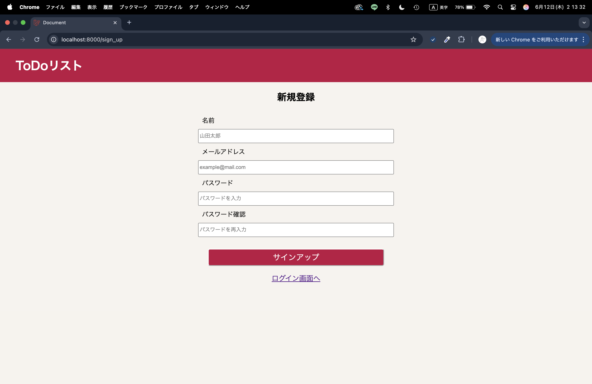
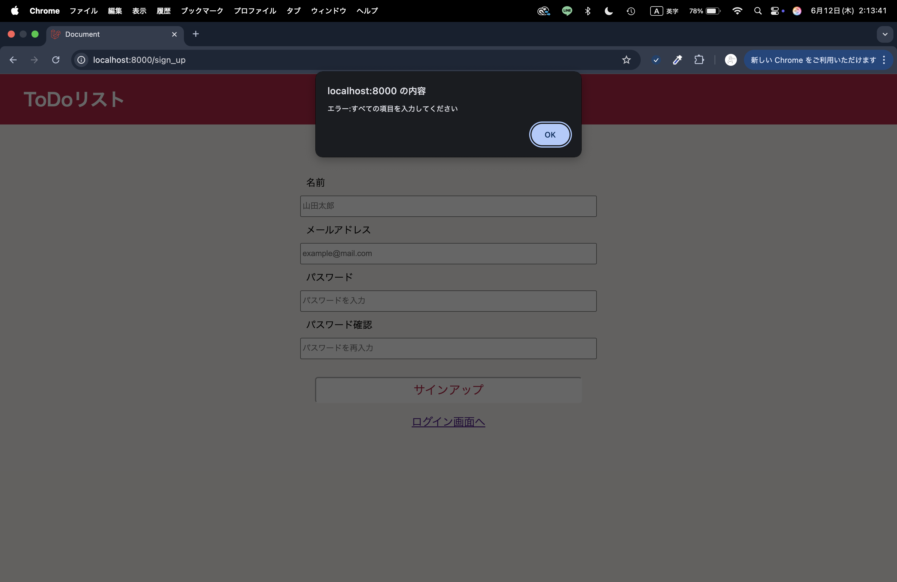
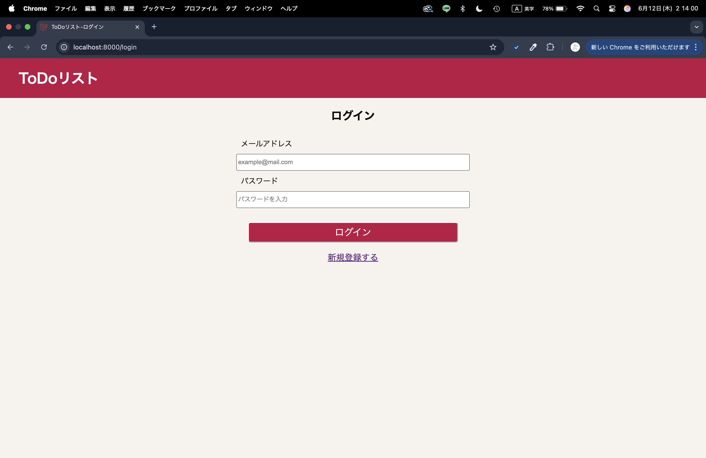
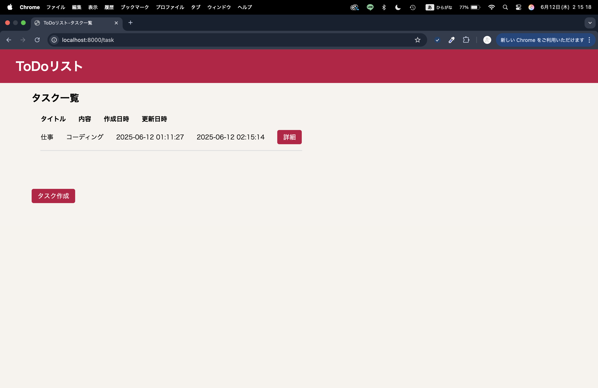
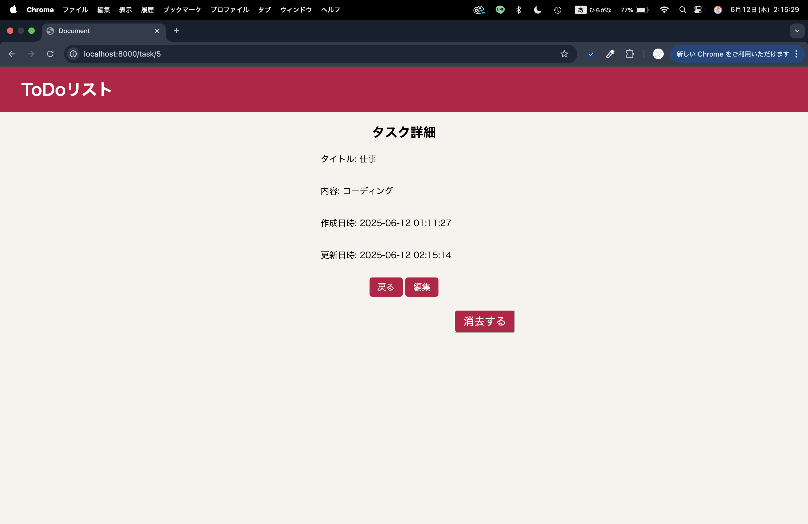
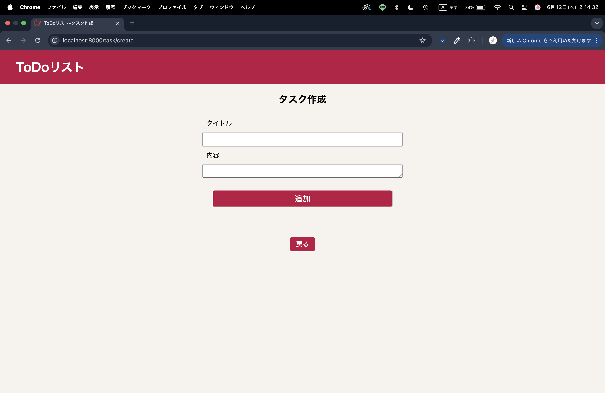
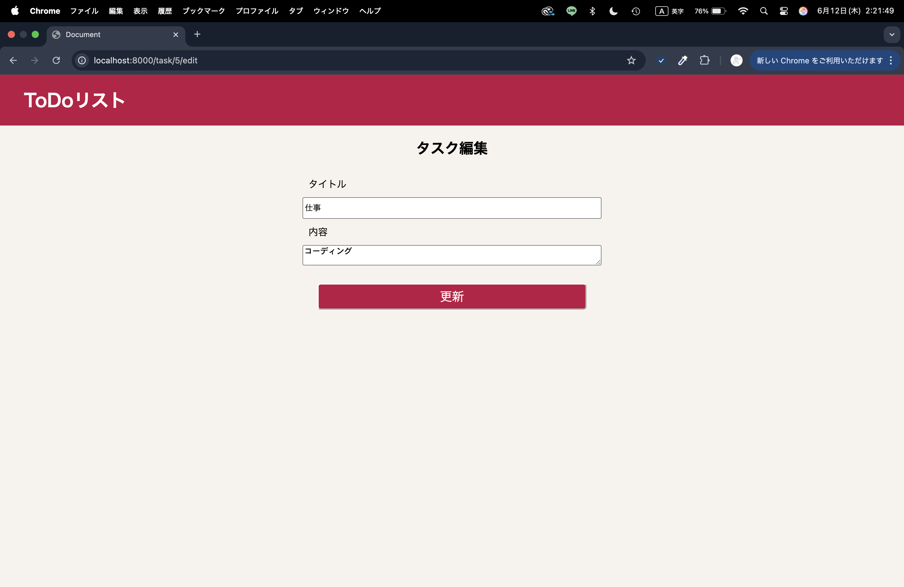

# ✅ Laravel ToDo

> Laravelで構築したタスク管理Webアプリケーション

---

## 📌 概要

ユーザーが自分のタスクを登録・管理できるWebアプリです。  
アカウント登録・ログインにより、各ユーザーのタスクをセキュアに管理します。  
タスクの追加・編集・削除に加え、バリデーションや画面遷移の利便性向上も実装しています。

---

## 🛠️ 技術スタック

| カテゴリ | 使用技術 |
|---|---|
| バックエンド | PHP / Laravel |
| フロントエンド | HTML / CSS / JavaScript |
| データベース | MySQL |

---

## ✨ 主な機能

- **ユーザー認証** ― 新規登録・ログイン・ログアウト
- **タスク管理（CRUD）** ― 一覧・詳細・作成・編集・削除
- **フォームバリデーション** ― 未入力時のJavaScriptアラート表示
- **UI設計** ― CSSによるレイアウト構築・画面遷移の最適化

---

## 🔧 設計のポイント

- **MVC アーキテクチャ** ― LaravelのRouting / Controller / Model / View を活用した実装
- **認証** ― Laravel標準の認証機能でユーザーごとのデータを分離管理
- **フロント連携** ― JavaScriptでバリデーションを追加しUXを向上

---

## 📸 スクリーンショット

| 画面 | |
|---|---|
| 新規登録 |  |
| 新規登録（アラート表示） |  |
| ログイン |  |
| タスク一覧 |  |
| タスク詳細 |  |
| タスク作成 |  |
| タスク編集 |  |
