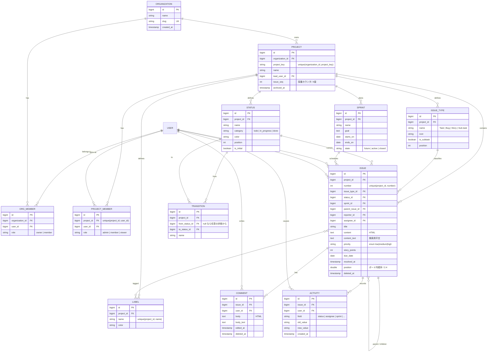

# 最小限の Jira クローンへのリメイク設計

対象リポジトリ: `laravel_app/`（Laravel 12 / 既定 DB は SQLite、MySQL 切替可）

この文書は、現在の「個人向け ToDo アプリ」を「複数人・複数プロジェクトで使える最小限の課題管理ツール」へ作り替えるための設計案である。
実装は含まない。各章の末尾に **採用しなかった案** を記載する。

---

## 0. 現状の把握

読んだ範囲での既存構造。

| 要素 | 内容 |
| --- | --- |
| `tasks` | `id, user_id, title, content(HTML), content_text, status, priority, position, due_date, completed_at, timestamps, deleted_at` |
| `subtasks` | `id, task_id, title, is_done, position, timestamps` |
| `tags` / `tag_task` | `tags(id, user_id, name, color)`、中間表 `tag_task(task_id, tag_id)` |
| `users` | Laravel 標準（`name, email, password`） |
| Enum | `TaskStatus(todo/doing/done)` / `TaskPriority(low/medium/high)` / `TagColor(6色)` |
| Policy | `TaskPolicy` / `TagPolicy`。いずれも `user_id === auth()->id()` のみ |
| ルート | `tasks` resource、`board` + `board/{task}` PATCH、`tasks/{task}/subtasks/*`、`tags`（index/store/update/destroy）、`dashboard`、認証系 |

現状の設計上の特徴で、移行に効いてくる点:

- **所有者スコープがモデル直下にある。** `Auth::user()->tasks()` が全コントローラの入口で、これが唯一の認可境界になっている。
- **ステータスが Enum ハードコード。** `TaskStatus` が DB 値・ラベル・バッジ色・カンバンのレーン定義を兼ねている。
- **`position` が「ユーザー内でステータス横断」の連番。** `BoardController@move` はレーン内の ID 配列を受け取って 0 起点で振り直す。
- **`content` は HTML + `content_text`（検索用平文）の二重持ち。** Accessor/Mutator で同期している。これは Issue でもそのまま使える良い資産。
- **`Model::shouldBeStrict()` が有効。** 未定義属性アクセスと N+1 が非本番では例外になる。関連を増やす設計では eager load を最初から意識する必要がある。

---

## 1. ドメインモデル

### 1.1 方針

- 最上位は **Organization**（Workspace ではなく Organization を採る。理由は 1.3）。
- **Status はマスタ化する**（Enum をやめる）。Jira らしさの中核は「プロジェクトごとにワークフローが違う」こと。ここを Enum のまま残すと Transition が定義できない。
- **Priority は Enum のまま残す**。プロジェクト別に変える要求は最小構成では出ない。既存の `weight()`・`badgeClasses()` がそのまま使える。
- **Label は既存 `tags` の改名**。ただし所有者を User から Project へ移す。
- **Subtask は廃止し、Issue の自己参照（parent_issue_id）に統合する**（理由は 2.3）。

### 1.2 ER 図



### 1.3 主要な判断と、採らなかった案

**Organization を置く / Workspace ではなく Organization**
プロジェクト横断で持ちたいのは「誰がこの会社の人か」という所属であり、Workspace という語は「画面の作業領域」とも読めて曖昧。`ORG_MEMBER.role` は `owner|member` の 2 値に留め、実際の権限判定は ProjectMember に寄せる（3 章）。

- 採らなかった: **Organization なしで Project を最上位にする。** 実装は軽いが、「課題キーの一意性はどこまでか」「ユーザー招待の単位は何か」の答えが無くなる。特に `PROJ` キーはグローバル一意にせざるを得なくなり、他人の作ったキーと衝突する。
- 採らなかった: **Organization ↔ Project を多対多。** Jira にそんな概念はなく、認可の推論が一段複雑になるだけ。

**Status をプロジェクト単位のマスタにする**
`STATUS.category` に `todo|in_progress|done` の 3 値を持たせ、「完了扱いか」の判定（既存 `isCompleted()` / `isOverdue()` 相当）はここで行う。ボードのレーンは Status 行そのもの。

- 採らなかった: **Status をグローバルマスタにする。** プロジェクトごとのワークフローが作れず、Enum のままと大差ない。
- 採らなかった: **Workflow テーブルを挟んで複数プロジェクトで共有する。** Jira 本体はそうだが、最小構成では Project ごとのコピーで十分。共有が欲しくなったら `statuses.workflow_id` を後付けできる。

**Transition を専用テーブルにする**
`from_status_id` が NULL の行を「どの状態からでも遷移可」とする（Jira の global transition）。遷移可能判定は `Transition::where(...)` の存在確認だけで済む。

- 採らなかった: **遷移制約を持たず、どの状態へも自由に動かせるようにする。** 最小構成としては成立するが、それは今のカンバンと同じで「Jira クローン」にならない。ただし **Phase 分割では後回しにする**（5 章 Phase 4）。テーブルだけ先に作り、判定を「Transition 行が 0 件なら全許可」とフォールバックさせれば段階導入できる。
- 採らなかった: **Transition に条件式（JSON の condition）を持たせる。** 最小限を超える。役割による遷移制限が欲しくなったら `transitions.required_role` の 1 カラム追加で足りる。

**Activity を汎用の変更ログ 1 テーブルにする**
`field / old_value / new_value` の文字列 3 本。コメント追加やラベル変更もここに書けば、Issue 詳細のタイムラインは Comment と Activity の UNION で描ける。

- 採らなかった: **Laravel のイベント + 監査パッケージ（spatie/laravel-activitylog 等）。** 表示要件が「この課題のタイムライン」に限定されるため、汎用ログの JSON payload を毎回解釈するより専用テーブルが速く、クエリも素直。
- 採らなかった: **`old_value/new_value` を JSON に。** 表示は常に文字列化するので、書くときに文字列化しておけば読むのが単純になる。ID が必要な場合は `old_value` に ID、表示名は join で引く。

---

## 2. 既存 Task → Issue への移行

### 2.1 カラムの棚卸し

| 既存カラム | 扱い | 備考 |
| --- | --- | --- |
| `id` | **流用** | 主キーは触らない。既存のリンク・ブックマークが生きる |
| `user_id` | **意味を変えて流用** → `reporter_id` | 「作成者」として最も自然。`assignee_id` は移行時 `reporter_id` と同値で埋める |
| `title` | **流用** | |
| `content` / `content_text` | **流用** | `RichText` の sanitize / toPlainText はそのまま。Comment でも同じ仕組みを再利用する |
| `status`（文字列 enum） | **置換** → `status_id` | 移行時に `todo/doing/done` を Status 行へマップ |
| `priority` | **流用** | Enum を維持。`TaskPriority` → `IssuePriority` に改名するだけ |
| `due_date` | **流用** | |
| `completed_at` | **改名して流用** → `resolved_at` | 意味は同じ（完了時刻）。`status.category === 'done'` と整合させる |
| `position` | **型を変えて流用** | `unsignedInteger` → `double`（2.4） |
| `deleted_at` | **流用** | SoftDeletes 継続 |
| — | **追加** | `project_id, number, issue_type_id, sprint_id, parent_issue_id, assignee_id, story_points` |
| `subtasks` テーブル | **廃止（データは Issue へ移送）** | 2.3 |
| `tags.user_id` | **捨てる** → `labels.project_id` | 2.5 |

**捨てるもの**
- `TaskStatus` Enum のバッジ色・ラベル（Status 行の `color` / `name` に移す）。
- `tasks.status` の文字列カラム（Phase 完了後に drop）。
- `subtasks` テーブル本体（データ移送後に drop）。
- `TaskPolicy` / `TagPolicy` の `user_id` 一致ロジック（3 章で置換）。

### 2.2 マイグレーション戦略（Expand → Migrate → Contract）

**壊さない**とは、各ステップ単独でデプロイでき、かつその時点のアプリコードが動くこと。ステップ間に「新旧カラムが両方生きている」期間を必ず設ける。

> 前提として、本番相当の DB が MySQL か SQLite かで実行可能な DDL が違う。SQLite は `ALTER TABLE` の制約が強く、Laravel は非破壊カラム変更をテーブル再作成でエミュレートする。**下記はどちらでも通るよう、「追加 → 埋める → 落とす」だけで構成し、in-place の型変更を避けている。**

**Step 1 — 新テーブルを足すだけ（既存コードは無変更で動く）**
`organizations, organization_members, projects, project_members, issue_types, statuses, transitions, sprints, labels, issue_label, comments, activities` を新規作成。この時点で `tasks` には一切触らない。ロールバックは全 drop で済む。

**Step 2 — 既存ユーザーごとに「個人 Organization / 個人 Project」を生成する（データ移行のみ、DDL なし）**
ここが移行の要。各 User に対し:
1. Organization を 1 つ（`name = "{$user->name} の組織"`, `slug` はユニーク化）
2. その下に Project を 1 つ（`project_key` は名前・メールから生成して衝突時は連番付与）
3. `project_members` に `role = admin` で本人を投入
4. 既定の IssueType（Task/Bug/Story/Sub-task）と Status 3 行（`未着手/進行中/完了` を `todo/in_progress/done` カテゴリで）を投入
5. そのユーザーの `tags` を、その Project 配下の `labels` としてコピー（`tag_id → label_id` の対応表を一時テーブルかメモリに保持）

コマンド（`php artisan issues:bootstrap-orgs`）として実装し、冪等にする。マイグレーションファイル内に長いデータ処理を書かず、マイグレーションからはコマンドを呼ぶだけにする（失敗時に再実行しやすい）。

**Step 3 — `tasks` に新カラムを nullable で追加する（Expand）**
`project_id, number, issue_type_id, status_id, sprint_id, parent_issue_id, assignee_id, story_points, position_new(double)` をすべて **nullable / デフォルトあり** で追加。外部キー制約はこの時点では張らない（埋まっていない行があるため）。既存コードは新カラムを知らないので影響なし。

**Step 4 — 新カラムを埋める（Migrate）**
- `project_id` ← Step 2 で作った、その `user_id` の個人 Project
- `status_id` ← `status` 文字列 → Status 行のマップ（`todo→未着手, doing→進行中, done→完了`）
- `issue_type_id` ← 既定の Task
- `assignee_id` ← `user_id`
- `number` ← プロジェクトごとに `created_at, id` 昇順で 1 起点の連番。同時に `projects.issue_seq` を最大値に更新（4 章）
- `position_new` ← `position * 1000`（double 化して隙間を作る）
- サブタスク移送: `subtasks` の各行を `issues` の新規行として作る。`parent_issue_id = task_id`、`issue_type_id = Sub-task`、`status_id` は `is_done ? 完了 : 未着手`、`number` は親と同じプロジェクトの採番から新規取得
- `tag_task` → `issue_label`（Step 2 の tag→label 対応表を使う）

チャンク処理（`chunkById`）で実行し、進捗をログに出す。件数が小さい個人アプリなので 1 トランザクションでも通るが、コマンドはプロジェクト単位で再実行可能にしておく。

**Step 5 — アプリコードを Issue モデルへ切り替える（コードのみ、DDL なし）**
`Task` を `Issue` に改名（テーブルは `tasks` のまま、`protected $table = 'tasks'`）。書き込みは **新旧カラムを両方更新する**（`status` 文字列と `status_id` を同時に書く）。読み取りは新カラムから。これでロールバックしても旧コードが動く。

**Step 6 — 制約を締める（Contract 前半）**
新カラムが全行埋まったことを確認したうえで、`project_id / status_id / issue_type_id / number` を `NOT NULL` 化し、外部キーと `unique(project_id, number)` を張る。ここは新テーブルを作って `INSERT ... SELECT` し、`tasks` → `issues` へリネームする形にすると SQLite でも安全（Laravel の `->change()` に頼らない）。**この Step で初めてテーブル名を `issues` に変える。**

**Step 7 — 旧カラム / 旧テーブルを落とす（Contract 後半）**
`status`（文字列）、`position`（int 版）、`subtasks`、`tags`、`tag_task` を drop。Step 5 の二重書き込みコードもここで除去。

この 7 ステップのうち、**Step 5 の前後で必ず 1 デプロイ以上の間隔を空ける**こと。Step 4 と Step 5 を同時に出すと、移行コマンドが走り切る前に新コードが nullable な `status_id` を読んで落ちる。

- 採らなかった: **`issues` テーブルを新規に作り、`tasks` から全件コピーして `tasks` を捨てる。** 一見きれいだが、`issues.id` を振り直すと既存 URL（`/tasks/12`）が全部死ぬ。ID を維持するなら結局 `INSERT ... SELECT` で、Step 6 と同じことをやることになる。**ただし本番データが実質デモ用しかないなら、この案の方が速い**（判断材料: `DemoUserSeeder` があり、実運用データが無いなら Step 3〜7 をまとめて 1 本にしてよい）。
- 採らなかった: **`tasks` を残して `issues` から 1:1 で参照する（継承テーブル方式）。** join が全クエリに乗り、`Model::shouldBeStrict()` 下での eager load 設計が無駄に複雑になる。得るものがない。
- 採らなかった: **`status` 文字列カラムをそのまま残し、`status_id` と併存させ続ける。** 二重の真実が残り、必ずどちらかがずれる。

### 2.3 Subtask を Issue に統合する理由

Jira のサブタスクは「親を持つ課題」であって、別の型のレコードではない。統合すると、サブタスクにも担当者・ステータス・コメント・課題キーが付く。既存 `Task::progress()` は「子 Issue のうち `status.category === 'done'` の割合」に置き換えれば、そのまま意味が通る。

- 採らなかった: **`subtasks` テーブルを残す。** 移行が楽なのは事実だが、「サブタスクに担当者を付けたい」が必ず来て、そのとき同じ移行をやり直す羽目になる。
- 採らなかった: **`parent_issue_id` ではなく汎用の `issue_links` テーブル（blocks / relates / subtask）。** 親子は「1 つしか持てない」「ボードでの集約に使う」点で他のリンクと性質が違い、外部キー 1 本のほうがクエリが単純。`issue_links` は将来 `blocks/duplicates` 用に別途足せばよい。

### 2.4 `position` を double にする理由

現状の `BoardController@move` は、レーン内の全 ID を受け取って 0..n を振り直す。プロジェクト単位・複数人になると、ドラッグ 1 回で数百行 UPDATE が走り、しかも 2 人が同時に並べ替えると後勝ちで相手の並びが消える。

double にして「挿入位置の前後の値の中間を入れる」方式にすれば、1 回の移動は **1 行 UPDATE** で済み、同時操作も衝突しにくい。精度が尽きたら（前後の差が閾値未満になったら）そのレーンだけ非同期で再採番する。

- 採らなかった: **現状の一括再採番のまま。** 上記の通りスケールしないが、**Phase 1〜2 の間は現状維持でよい**（人数が増えるまで顕在化しない）。Phase 3 のボード刷新時に切り替える。
- 採らなかった: **LexoRank（Jira 本体の方式、文字列ランク）。** 再採番が要らず理論的には優れるが、実装量が double 方式の数倍。最小構成には過剰。

### 2.5 Tag → Label の所有者移動

現状 `tags` は `unique(user_id, name)`。これを `unique(project_id, name)` に移す。移行時、あるユーザーのタグは、そのユーザーの個人 Project 配下にコピーされる（Step 2）。

- 採らなかった: **Label を Organization 単位にする。** プロジェクト間でラベル名の意味が違うのが普通で、候補リストが汚れる。
- 採らなかった: **Label をマスタ化せず、Jira 本体のように Issue 側の文字列配列にする。** 色（既存 `TagColor`）が持てなくなり、既存資産を捨てることになる。

---

## 3. 認可モデル

### 3.1 現状と目標

現状: `TaskPolicy` が `$user->id === $task->user_id` を 3 メソッドで繰り返しているだけ。加えて、実質的な認可の大半は **Policy ではなくクエリスコープ**（`Auth::user()->tasks()`）が担っている。

目標: 判定の根拠を `project_members.role` に移す。

| role | できること |
| --- | --- |
| `viewer` | プロジェクトと Issue の閲覧、コメントの閲覧 |
| `member` | viewer + Issue の作成・編集・遷移・コメント投稿・自分のコメント編集削除 |
| `admin` | member + プロジェクト設定（Status/Transition/IssueType/Label/Sprint）、メンバー招待と role 変更、他人のコメント削除、プロジェクトのアーカイブ |

`organization_members.role = owner` は、その組織配下の全プロジェクトに対して `admin` 相当として **Gate::before で上書き**する。

### 3.2 責務分割

**(a) クエリスコープ — 「見えるものの集合」**
`Issue::visibleTo(User $user)` のようなスコープで、`project_members` に自分の行があるプロジェクトの Issue だけに絞る。一覧・検索・ボードはこれを通す。**Policy は一覧を守れない**（1 件ずつの判定しかできない）ので、ここは分けて持つ必要がある。現状の `Auth::user()->tasks()` の役割の後継。

**(b) Policy — 「特定の 1 件に対して何ができるか」**
- `ProjectPolicy`: `view / update / manageMembers / archive`
- `IssuePolicy`: `view / create / update / delete / transition / assign`
- `CommentPolicy`: `create / update / delete`（自分のものか、admin か）
- `SprintPolicy`: `view / manage / start / complete`

各 Policy は「その Project における自分の role」を 1 回引いて判定する。Issue → Project の解決が毎回走るので、**`ProjectMember` の (project_id, user_id) → role を、リクエスト単位でメモ化する**（`Model::shouldBeStrict()` の N+1 検出に引っかかるのを防ぐ意味でも）。

**(c) Gate — 「モデルに紐づかない、あるいは横断する判定」**
- `Gate::before`: Organization owner による全許可
- `Gate::define('create-project', ...)`: 対象モデルが存在しない操作（Organization を引数に取る）
- `Gate::define('access-organization', ...)`: 組織所属チェック

**(d) Middleware — 「URL の階層と認可の階層を一致させる」**
ルートを `/projects/{project}/issues/{issue}` のようにネストし、`can:view,project` ミドルウェアをグループに掛ける。これで各コントローラメソッドの `$this->authorize('view', $task)` の繰り返しが消え、「プロジェクトに入れる人だけがその下に到達できる」が構造として保証される。Issue 単位の判定（自分が reporter なら削除できる 等）だけを Policy に残す。

加えて **route model binding のスコープ化** を使い、`{issue}` は `{project}` 配下のものしか解決しないようにする（`Route::scopeBindings()`）。他プロジェクトの Issue ID を URL に入れても 404 になり、認可漏れが構造的に起きにくい。

### 3.3 採らなかった案

- **spatie/laravel-permission を入れる。** グローバルな role/permission が主眼で、「プロジェクトごとに違う role」はチーム機能を使っても表現が回りくどい。`project_members.role` の 1 カラムのほうが単純で、SQL で直接絞れる（一覧スコープで効く）。
- **role を中間テーブルではなく `permissions` JSON にする。** 3 段階しかないうちは可読性が落ちるだけ。role が足りなくなったら `project_roles` テーブルへ正規化する道は残る。
- **Policy を廃して全部 Gate にする。** モデル単位の判定は Policy のほうが Laravel の慣習に沿い、`$this->authorize()` / `@can` がそのまま効く。
- **`user_id` ベースの判定を「reporter なら常に編集可」として残す。** viewer に降格した人が過去の自分の Issue を編集できてしまう。role を唯一の根拠にし、reporter の特別扱いは **削除（`delete`）のみ**に限定する。

---

## 4. 課題キー（PROJ-123）の採番

### 4.1 要件

- 表示は `projects.project_key` + `-` + `issues.number`（カラム名を `key` にしないのは MySQL の予約語だから）。**キー文字列は保存しない**（プロジェクト名変更時に全行更新したくない）。`Issue::key()` アクセサで組み立てる。
- `unique(project_id, number)` を **DB 制約として必ず張る**。以下のどの方式でも、最後の砦はこれ。
- URL は `/browse/PROJ-123` で引けること（`projects.project_key` + `issues.number` の 2 条件検索。`unique` がそのままインデックスとして効く）。

### 4.2 採用案: `projects.issue_seq` を行ロック付きでインクリメント

```
BEGIN;
  SELECT issue_seq FROM projects WHERE id = ? FOR UPDATE;   -- 行ロック
  UPDATE projects SET issue_seq = issue_seq + 1 WHERE id = ?;
  INSERT INTO issues (project_id, number, ...) VALUES (?, issue_seq + 1, ...);
COMMIT;
```

Laravel では `Project::whereKey($id)->lockForUpdate()->first()` をトランザクション内で行う。ロック範囲は「その 1 プロジェクトの 1 行」だけなので、別プロジェクトの作成は一切ブロックされない。ロック保持時間は Issue の INSERT 1 回分。

**SQLite での挙動に注意。** `FOR UPDATE` は SQLite では無視される（構文エラーにはならないが効かない）。SQLite の書き込みは DB 全体が直列化されるため実害は出にくいが、「効いているつもり」になるのが危険。そこで:

1. **`unique(project_id, number)` を必ず張る。**
2. 採番 + INSERT を **リトライで包む**（unique 制約違反を捕まえて、最大 3〜5 回まで採番からやり直す）。`Illuminate\Database\UniqueConstraintViolationException` を捕捉する。
3. MySQL なら `FOR UPDATE` が効いてリトライはほぼ発火しない。SQLite でもリトライが最後の防波堤として機能する。

この「ロック + DB 制約 + リトライ」の三段構えが具体案。ロックは平常時の性能のため、制約は正しさのため、リトライは可用性のため、と役割が分かれている。

**バルク作成（CSV インポート等）**では、1 件ずつロックを取らず、`issue_seq = issue_seq + N` を 1 回で実行して `[seq+1, seq+N]` の範囲を予約し、アプリ側で割り振る。

**欠番について。** トランザクションがロールバックすると番号が飛ぶ。これは許容する（Jira も飛ぶ）。「番号を詰める」要件を入れると、採番を直列化せざるを得なくなり、得るものに対して代償が大きい。

### 4.3 採らなかった案

- **`MAX(number) + 1` を採る。** 最も素朴だが、同時実行で確実に同じ値を読む。`unique` 制約があれば壊れはしないものの、衝突頻度が高く、リトライが常態化する。負荷が上がるほど悪化する（ロック方式は逆に、待つだけで衝突しない）。
- **`issues.id`（グローバル AUTO_INCREMENT）をそのまま番号に使う。** 採番の問題は消えるが、`PROJ-1, PROJ-7, PROJ-23` と歯抜けになり、「プロジェクト内の通し番号」という利用者の期待を裏切る。Jira クローンを名乗るなら採れない。
- **Redis の `INCR` で採番する。** 高速かつアトミック。ただし Redis と DB の間で整合を取る手段がなく（Redis が飛ぶと番号が巻き戻る）、この規模で依存を 1 つ増やす理由がない。DB だけで完結させる。
- **`project_counters` を別テーブルに切り出す。** `projects` 行のロックが他の更新（プロジェクト名変更など）とかち合うのを避けられる。理屈は正しいが、プロジェクト設定の更新頻度は極めて低く、テーブルを 1 枚増やす価値がない。**将来 `projects` の更新が増えたら切り出す**、という順序でよい。
- **キー文字列 `PROJ-123` を `issues.issue_key` として非正規化保存する。** 検索は速いが、プロジェクトキー変更時に全行 UPDATE が要る。プロジェクトキーの変更は Jira でも実在する操作なので、組み立て式にしておく。

---

## 5. 実装フェーズ

各フェーズは **単体でデプロイ可能**（その時点でアプリが動き、ユーザーに価値があるか、少なくとも害がない）を満たす。フェーズ番号は 2.2 の Step 番号とは独立。

### Phase 0 — 土台（ユーザーに見える変化なし）
- 2.2 Step 1: 新テーブル群の作成
- Model / Factory / Seeder の骨組み
- `Organization`, `Project`, `ProjectMember` のみ実装。画面なし
- **デプロイ可能性**: 既存アプリは完全に無変更で動く。ロールバックは drop のみ

### Phase 1 — プロジェクトの器と、既存データの引っ越し
- 2.2 Step 2〜4: 個人 Organization / Project の自動生成、既存 Task への `project_id` 等の埋め込み
- 2.2 Step 5: `Task` → `Issue` へのコード切替（新旧二重書き込み）
- プロジェクト一覧・作成画面、メンバー招待（招待は最小: 既存ユーザーをメールで追加）
- 認可: 3 章 (a) スコープと `ProjectPolicy` を導入。`IssuePolicy` はまだ「プロジェクトメンバーなら全許可」
- **ユーザーに見える価値**: 「自分のタスクが 1 つのプロジェクトに入った」「他人を招待できる」
- **デプロイ可能性**: 既存の `/tasks` URL は維持したまま、`/projects/{project}/issues` を追加で生やす

### Phase 2 — Issue の中身（型・ステータスマスタ・担当者・コメント）
- 2.2 Step 6〜7: 制約の締めと旧カラムの drop、`tasks` → `issues` リネーム
- `IssueType`, `Status` マスタと、プロジェクト設定画面（admin のみ）
- `assignee_id`、Comment、Activity
- 課題キー（4 章）の導入と `/browse/{key}` ルート
- 認可: `IssuePolicy` / `CommentPolicy` を role ベースで本実装（3 章）
- Subtask → 子 Issue への移送と `subtasks` drop
- **ユーザーに見える価値**: 担当者を付けられる、議論できる、変更履歴が見える、課題キーで呼べる
- **デプロイ可能性**: Phase 1 の二重書き込みを前提に、drop は最後に出す。旧 `/tasks` はここで `/browse` へ 301

### Phase 3 — ボードとスプリント
- Sprint モデル、バックログ画面、スプリント開始/完了
- ボードを Status マスタ駆動に（レーン = Status 行）
- `position` の double 化と 1 行 UPDATE 化（2.4）
- **ユーザーに見える価値**: 反復計画ができる
- **デプロイ可能性**: `sprint_id` は nullable なので、スプリントを使わない運用が壊れない

### Phase 4 — ワークフロー制約と仕上げ
- Transition の適用（`transitions` が 0 件のプロジェクトは全許可でフォールバック）
- ステータス遷移 UI をボタン群に（「次に取れる遷移」だけ表示）
- 検索の強化（`content_text` ベースの横断検索、簡易 JQL 風フィルタ）
- 通知（担当割り当て・メンション）
- **デプロイ可能性**: フォールバックがあるので、Transition を定義していない既存プロジェクトは挙動が変わらない

### フェーズ分割で採らなかった案

- **「モデル層を全部作ってから画面を作る」縦割り。** Phase 0 で全テーブルを作りきり、Phase 1 で全画面、という分け方。中間状態でデプロイしても何も動かず、「デプロイ可能な粒度」の要件を満たさない。
- **「新アプリとして別に作り、データを一括移行して切り替える」ビッグバン方式。** 個人プロジェクトなら現実的な選択肢ではある（既存データが実質デモのみなら最速）。採らなかったのは、リメイクの目的が「既存を壊さず育てられること」を示すことにあると読んだため。**もし既存データを捨ててよいなら、Phase 1 の移行部分（2.2 Step 2〜5）をまるごと削り、Phase 0 で `issues` を新規作成するのが正しい。** ここは実データの有無で判断を切り替えてよい。
- **課題キーを Phase 1 に前倒しする。** 見栄えの効果は大きいが、採番はプロジェクトが確定してからでないと設計が固まらず、Phase 1 の移行と採番バックフィルが絡み合って事故りやすい。Phase 2 に置いた。
- **Transition を Phase 2 に入れる。** ワークフロー制約は「間違って動かせない」という後ろ向きの価値で、担当者やコメントより優先度が低い。最後でよい。

---

## 6. 積み残しとして意識しておく点

- **`Model::shouldBeStrict()` が有効なので、関連が増えるほど eager load 漏れが例外になる。** Issue 一覧は `project, issueType, status, assignee, labels` + 子 Issue の集計カウントを常にロードする前提でクエリを組む。既存 `withCount(['subtasks', 'subtasks as done_subtasks_count'])` のパターンがそのまま子 Issue に流用できる。
- **`RichText` の sanitize は Comment でも必須。** 複数人が書く以上、XSS の入口が Issue 本文だけでなくコメントにも増える。`content` の Accessor/Mutator パターンを Comment にも同形で適用する。
- **`DemoLoginController` / `DemoUserSeeder` の扱い。** デモアカウントは「Organization にも Project にも所属済みの状態」でシードする必要がある。Phase 1 のブートストラップコマンドをシーダーからも呼べるようにしておく。
- **SQLite と MySQL の差。** 4 章のロックと 2.2 の DDL の両方で挙動が割れる。本番で MySQL を使うつもりなら、**Phase 0 の時点で CI を MySQL に切り替える**こと。SQLite で通ったマイグレーションが MySQL で落ちるのは、この種の移行で最も多い事故。
